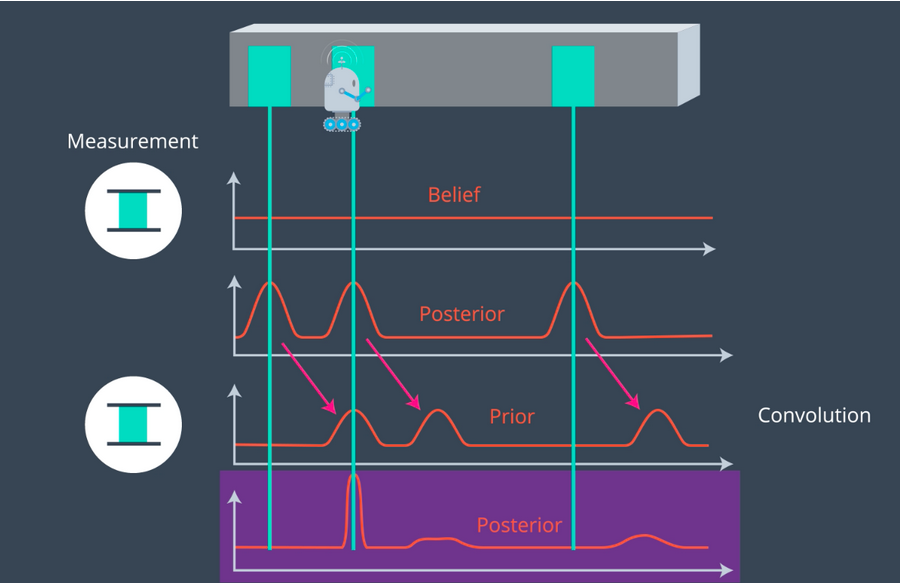

# 2D-Histogram-Filter
Using 2d histogram filter for localization 

### Loclisation consists of two cycles:
1. Sence - When a robot senses, a measurement update happens; this is a simple multiplication that is based off of Bayes' rule.
This step is followed by normalization to ensure that the resultant distribution was still vald (and added up to 1 probability).

2. Move - When it moves, a motion update or prediction step occurs; this step is a convolution that shifts the distribution in the direction of motion.

Sense/Move Cycle

  

After this cycle, we are left with an altered posterior distribution!

  

